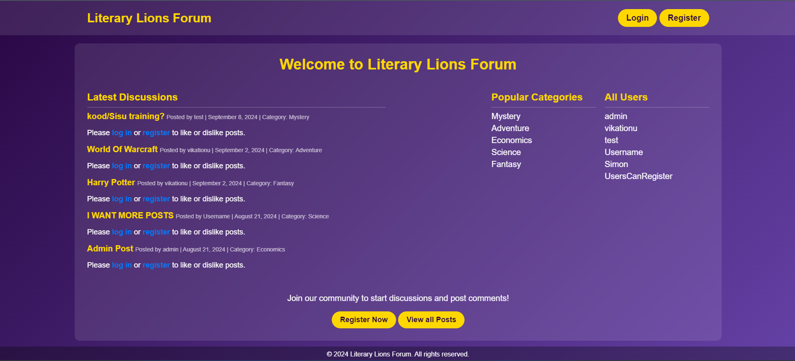

# Volumes



Literary Lions Forum is a vibrant web-based discussion platform for literature enthusiasts. Connect with fellow book lovers, share your thoughts on your favorite works, and engage in stimulating literary discussions.

## Table of Contents

- [Features](#-features)
- [Getting Started](#-getting-started)
  - [Prerequisites](#prerequisites)
  - [Installation](#installation)
    - [Option 1: Running with Docker](#option-1-running-with-docker)
    - [Option 2: Running without Docker](#option-2-running-without-docker)
- [Admin Access](#-admin-access)
- [Database](#-database)
- [Project Structure](#-project-structure)
- [Error Handling](#-error-handling)
- [Contributing](#-contributing)
- [Contact](#-contact)

## 🌟 Features

- 👤 User registration and authentication
- 📝 Create, read, update, and delete posts
- 💬 Dynamic commenting system
- 🏷️ Category-based post organization
- 👍👎 Like/dislike functionality for posts and comments
- 🛠️ Admin dashboard for content moderation and user management

## 🚀 Getting Started

### Prerequisites

- Go 1.22.3 or higher
- SQLite3
- Docker (optional)

### Installation

#### Option 1: Running with Docker

1. Clone the repository:

```sh
git clone https://github.com/raigoh/Volumes.git
cd Volumes
```

2. Build and run the Docker containers:

```sh
docker-compose up --build
```

3. Access the forum at http://localhost:8080

#### Option 2: Running without Docker

1. Ensure Go and SQLite3 are installed on your system.

2. Clone the repository:

```sh
git clone https://github.com/raigoh/Volumes.git
cd Volumes
```

3. Install dependencies:

```sh
go mod download
```

4. Run the server:

```sh
go run cmd/server/main.go
```

5. Access the forum at http://localhost:8080

## 👑 Admin Access

To access the admin dashboard:

1. Log in with the default admin credentials:

   - Email: admin@admin.com
   - Password: admin

2. Navigate to /admin/dashboard to access admin features.

## 💾 Database

The project uses SQLite as its database. The database file is automatically created in the ./data directory when you run the server for the first time.

### Database Structure


## 🏗️ Project Structure

```
literary-lions-forum/
├── cmd/
│ └── server/
│ └── main.go
├── internal/
│ ├── Admin/
│ ├── auth/
│ ├── category/
│ ├── comment/
│ ├── errors/
│ ├── home/
│ ├── like/
│ ├── models/
│ ├── post/
│ ├── user/
│ └── utils/
├── pkg/
│ ├── database/
│ └── session/
├── web/
│ └── static/
│ ├── css/
│ ├── images/
│ └── templates/
├── data/
├── dockerfile
├── docker-compose.yml
├── go.mod
├── go.sum
└── README.md
```

## 🐛 Error Handling

The application handles errors gracefully, displaying user-friendly error pages. Detailed error logs are available in the server console for administrators.

## 📞 Contact

- Raigo Hõim - @discord: vikationu
- Simon Brown - @discord: Simon Brown
- Project Link: https://gitea.koodsisu.fi/raigohoim/literary-lions-forum.git
