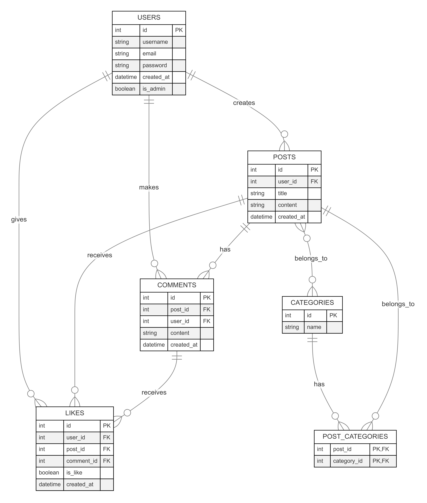

# LITERARY LIONS FORUM

## USAGE

### Docker

Program and the database can be run from docker.

Make sure you have docker installed on your computer

Create the docker image using command <code>docker compose up</code> within the root folder where dockerfile and docker-compose.yml are located

--- THIS IS NOT REALLY WORKING?!!?!?!? ---

### From the commandline, without docker

The program can be run from the CLI using <code>go run cmd/server/main.go</code>

The server will start from default port 8080 and the website can be accessed from the browser <link>http://localhost:8080</link>

## Literary Lions Forum interface

### Creating a user

Users can register giving a username, email and password.
Password is protected, so that the registering user has to give the password twice and it has to the same password.

Passwords are stored in the database as blobs, so they cannot be seen if an unauthorized user gets hands on with the database file.

Duplicate usernames or emails is prohibited and blocked by the server.

### Login in as an existing user

Users can login using their email and password.

Logins sessions are handled using UUID sessions

### Admin

Admins can delete post and users if needed.
 The default admin user is
 email: admin@admin.com
 password admin

### Functionality of the forum

#### Posting

Posting can be done from the home page by clicking "create new post"
Every field is required before the post can be uploaded to the database

#### Reading post

Recent post can be seen on the home page, also filtering post by name or category is possible in this window.

Seeing all post can be done by

-- INSERT HERE HOW THE NEW PAGE WORKS --

#### Users

All the users post can be seen under the usernames profile

#### Likes and dislikes

Users can like or dislike post or comments by clicking the thumbs up or down button
Total likes and dislikes are shown in the button

### Error handling

All the errors will be handled without the user noticing them. Website will show an error page corresponding error info for the user.
Admins will find error in the command line correspoding what has happened.

## Database

Server uses SQLite database

### Structure

Sturcture of the database is shown here

